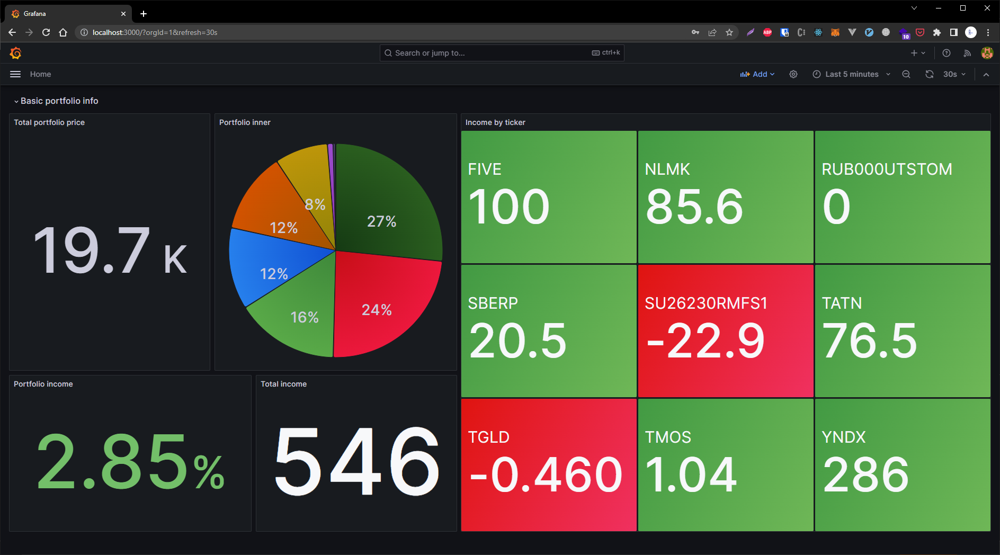
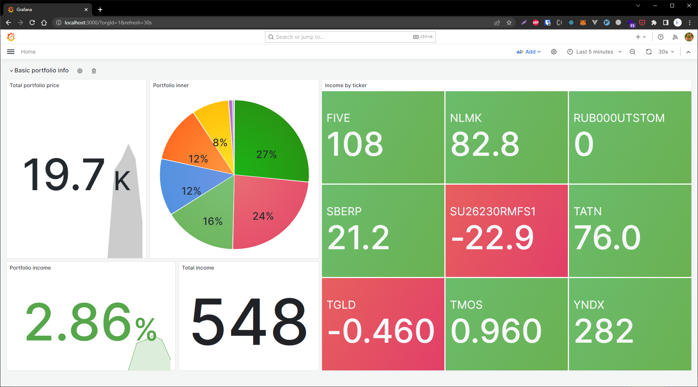

# Investment dashboard - сервис для мониторинга инвестиционного портфолио

*Внешний вид сервиса*

## Возможности
- [x] Отображение текущей стоимости портфолио
- [x] Отображение "доходности" каждого инструмента в портфолио
- [x] Отображение состава портфолио, соотношения инструментов
- [x] Отображение "доходности" портфолио и абсолютной величины "дохода"
- [ ] Переключение между разными портфолио/брокерами
- [ ] Отображение полноценных графиков динамики цены портфолио и отдельных инструментов
- [ ] Настройка уведомлений об изменениях в цене портфолио и отдельных инструментов

## Поддержка брокеров
- [x] Тинькофф инвестиции
- [ ] БКС
- [ ] СберИнвестиции

## Настройка и запуск

### Настройка
Для настройки доступа к данным портфолио потребуется записать в файл конфигурации данные доступа:
- Тинькофф инвестиции:
    1. Копируем файл `tinkoff_config.example.yaml`, называем `tinkoff_config.yaml`
    2. В файле дописываем ID портфолио и API ключ (подробнее о получении этих данных в [документации TINKOFF INVEST API](https://tinkoff.github.io/investAPI/))
    3. Изменяем остальные настройки, если требуется

### Запуск
- Вариант 1: Docker (рекомендуемый)
    1. Устанавливаем [docker](https://www.docker.com/)
    2. Пишем в консоли команду `docker compose up`
    3. Открываем в браузере страницу с дашбордом [http://localhost:3000](http://localhost:3000), логин и пароль по умолчанию: `admin:admin`
